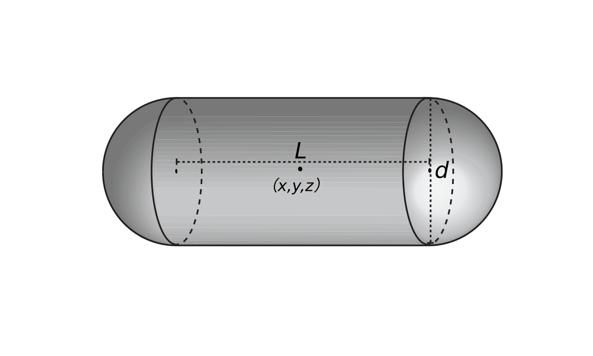

.. index:: atom_style bacillus

atom_style bacillus command
============================

Syntax
""""""

.. parsed-literal::

    atom_style bacillus

Description
""""""""""""""

Define the *bacillus* style of atoms in a simulation. 
This command must be used before a simulation is setup via a 
`read_data* <https://docs.lammps.org/read_data.html>`_, 
`read_restart* <https://docs.lammps.org/read_restart.html>`_, or
`create_box* <https://docs.lammps.org/create_box.html>`_ command.

   
For the *bacillus* style, atoms are represented as rods that model
rod-shaped microbes. 
Each microbe stores a set per-atom attributes,
including *length*, *diameter*, *mass*, *biomass*, *coordinate*,
as well as the mechanical attributes used in physical (DEM) processes
(e.g, *force*, *velocity*, *inertia*, *angular momentum*, etc).
 
The shape is implemented as cylinder with hemispherical caps.
Therefore, cell *length* is the height of the cylinder
(i.e, distance between the two hemispherical caps), and
cell width is the *diameter* of the cap.
The *mass* and *biomass* are the wet and dry weights of microbes, respectively. 

Initial microbes and their attributes can be specified in 3 ways:

* use `read_data* <https://docs.lammps.org/read_data.html>`_ command to explicitly create each individual microbe with the initial attributes from a data file;
* use `create_atom* <https://docs.lammps.org/create_atom.html>`_ and :doc:`set <set>` commands to create microbes on a lattice, or a single microbe, or a random collection of microbes;
* use `read_restart* <https://docs.lammps.org/read_restart.html>`_ command to read previously saved system configuration from a restart file.
