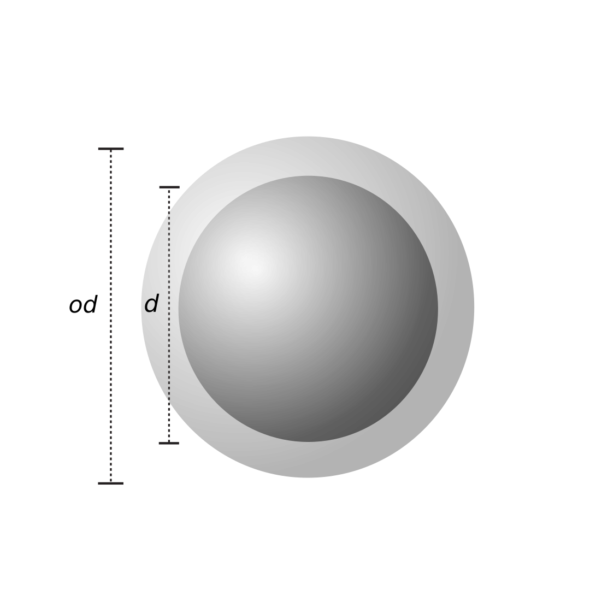

.. index:: atom_style coccus

atom_style coccus command
==========================

Syntax
""""""

.. parsed-literal::

    atom_style coccus

Description
""""""""""""""

Define the *coccus* style of atoms in a simulation. 
This command must be used before a simulation is setup via a 
`read_data* <https://docs.lammps.org/read_data.html>`_, 
`read_restart* <https://docs.lammps.org/read_restart.html>`_, or
`create_box* <https://docs.lammps.org/create_box.html>`_ command.

   
For *coccus* style, atoms are represented as spheres which model
spherical-shaped microbes.
Each microbe stores a set per-atom attributes, 
including *mass*, *biomass*, *outer_mass*, *diameter*, *outer_diameter*, *coordinate*,
as well as the mechanical attributes for DEM simulation (e.g, *force*, *velocity*, etc).
 
The *diameter* and *outer_diameter* specify the inner and outer sizes of a spherical microbes. 
Some microorganism can excretes extracellular polymeric
substances (EPS) which is initially accumulated as a extra shell beyond the microbes. 
The *outer_diameter* is defined as the depth of EPS shell plus the inner diameter,
and the *outer_mass* is the weight of EPS shell.
The *mass* and *biomass* are the wet and dry weights of microbes, respectively. 

Initial microbes and their attributes can be specified in 3 ways: 
1) use `read_data* <https://docs.lammps.org/read_data.html>`_ command to 
explicitly create each individual microbe with the initial attributes from a data file;
2) use `create_atom* <https://docs.lammps.org/create_atom.html>`_ command
to create microbes on a lattice, or a single microbe, or a random collection of microbes;
or 3) use `read_restart* <https://docs.lammps.org/read_restart.html>`_ command to read 
previously saved system configuration from a restart file.
