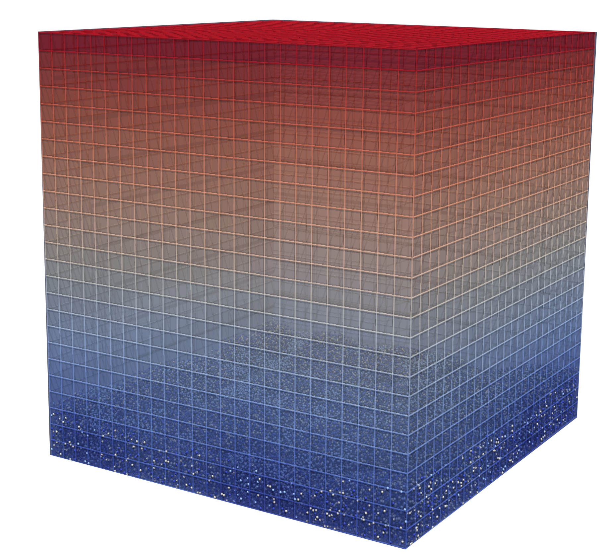

.. index:: grid_style chemostat

grid_style chemostat command
============================

Syntax
""""""

.. parsed-literal::

    grid_style nufeb/chemostat nsubs subID-1 subID-2 subID-3 ... scale
    
* nsubs = # of substrates 
* subID-i = ID of i\ :sup:`th` substrate 
* grid-size = scale factor between mesh grid and simulation box

Examples
""""""""

.. code-block:: 

   grid_style nufeb/chemostat 4 nh4 o2 no2 no3 4e-6
   grid_style nufeb/chemostat 2 sub o2 1e-5
   
Description
""""""""""""""

Define substrates and Cartesian mesh in simulation box for use by other Ib processes.
The grid_style assumes the micro-scale simulation box is a part of full-scale chemostat.

Substrates are growth media that are required by microbes for their metabolism.
They are modelled as continuous fields in NUFEB due to their potential solubility.
*nsubs* defines number of substrates available in the system, and *subID* assigns an unique string name to each of them.
The substrate names are used as references by other commands. 
For example, in order to use :doc:`fix nufeb/growth/aob <fix_growth_aob>` command,
three substrates must be defined in the grid_style to represent ammonium, oxygen and nitrite.

A mesh is a set cubic grids in space that is replicated infinitely in all dimensions.
The *scale* parameter defines grid length, 
which must be consistent with the dimension of orthogonal simulation box to ensure 
a 3D cubic structured mesh.
This means, for example, scale = 1e-5 is compatible with 
a 2e-4 x 1e-4 x 1e-4 simulation box, which generates 
a 20 x 10 x 10 cubic structured mesh. On the other hand, the scale cannot apply to 
a 2.05e-4 x 1e-4 x 1e-4 box as it is inconsistent with the x-dimension.

Similar to atoms, each grid is associated with a set of attributes including:
*substrate concentration*, *substrate utilisation rate*, *microbial growth rate*, *biomass density* and *diffusion coefficient*.
The values of these attributes can be accessed and/or changed by other Ib processes. 
For example, :doc:`fix nufeb/growth/aob <fix_growth_aob>` updates microbial growth rate and 
substrate utilisation rate, :doc:`fix nufeb/diffusion_reaction <fix_diffusion>` 
alters substrate concentrations, and fix nufeb/diffusion_coeff updates diffusion coefficient
based on biomass density. 
The grid_style also defines the global attributes *boundary condition* and *bulk concentration* 
for solving diffusion process or coupling with full-scale chemostat 
(e.g, :doc:`fix reactor/solute_balance <fix_reactor_solute_balance>`).
Their values are initialised in :doc:`grid_modify <grid_modify>` command. 

