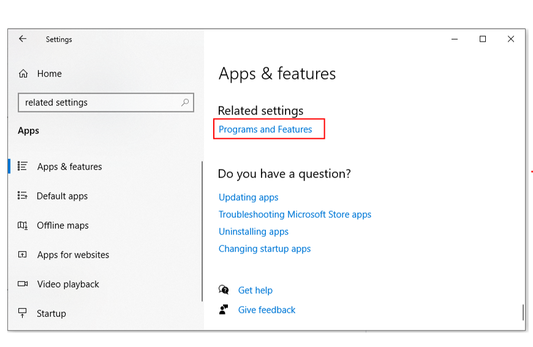
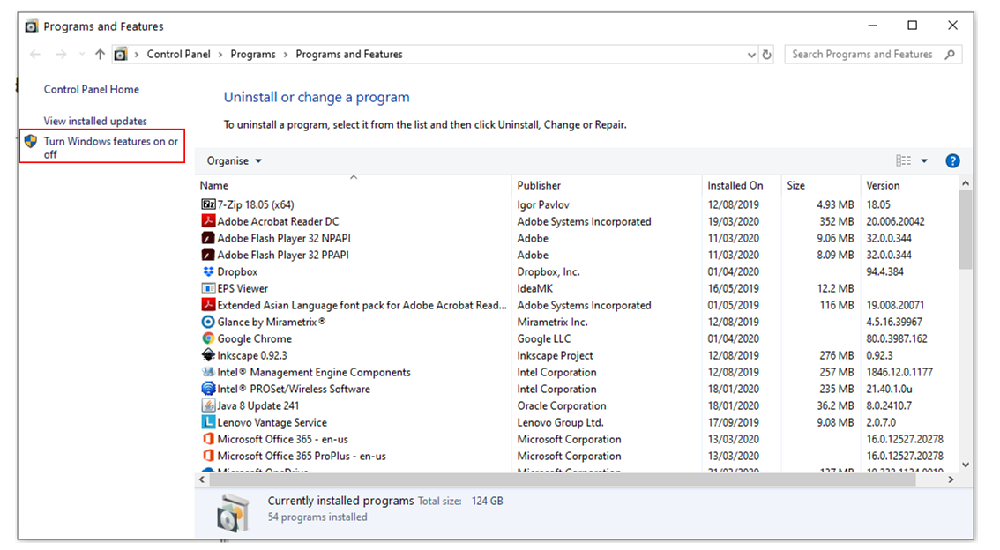
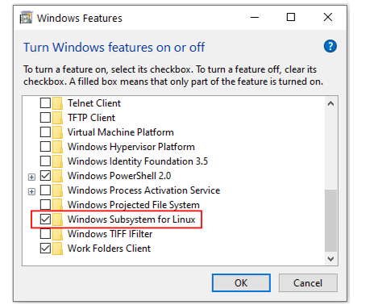
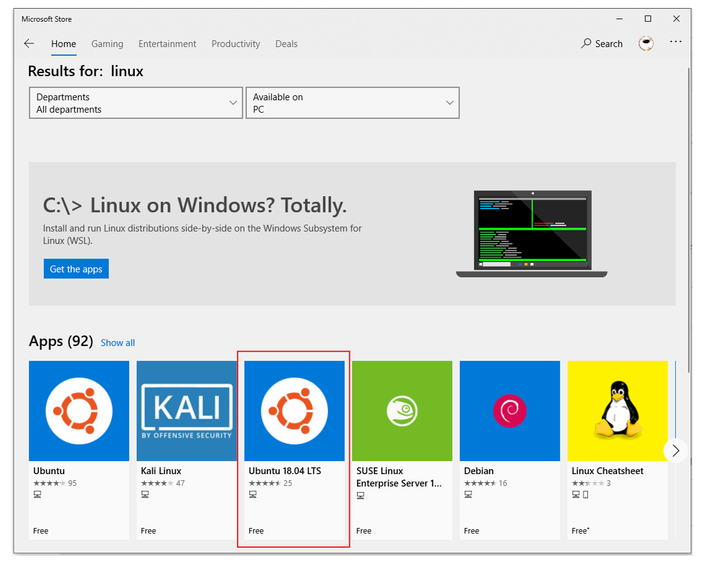
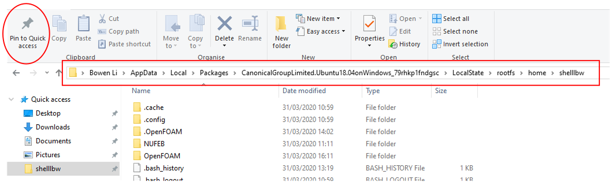
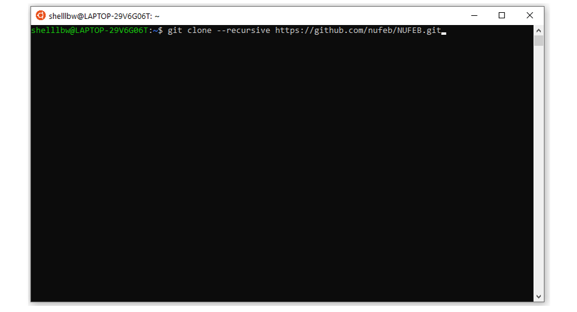

Install NUFEB on Windows
================================

NUFEB does not support a direct Windows installation. 
However, there are a few ways to use NUFEB on Windows via compatibility layer or virtual machine. 
If you are using Windows 10 (64bit) - consider using Windows Subsystem for Linux (WSL). 
Alternatively, you can use a virtual machine software and compile and run NUFEB in a Linux virtual machine.

This section provides instruction for using NUFEB via WSL.

.. contents:: 
		:local:
		:depth: 1
   

.. _install_win:

Install Windows Subsystem for Linux
----------------------------------------

Follow the steps below to install WSL on Windows 10:

1. Open **Setting**.
2. Click on **Apps**.
3. Under the "Related settings" section, click the **Programs and Features** option. 

   
4. Click the **Turn Windows features on or off** option from the left pane.

   
5. This opens a dialog with a list of features you can install. 
   Check the **Windows Subsystem for Linux** option and press *OK*.
   

   
6. Click the **Restart now** button to reboot your PC and apply the change.

Installing Linux distros from Microsoft Store
---------------------------------------------

1. Open **Microsoft Store**.
2. Search for the Linux distribution that you want to install 
   (for using NUFEB, we recommend Ubuntu 18.04 LTS or higher version).
   

   
 
3. Click the **Get** (or **Install**) button.
4. Launch Ubuntu in **Start** menu (e.g, Ubuntu 18.04 LTS).
5. In the bash, create a username and password.
6. The home directory of WSL is located in
    *%LOCALAPPDATA%\\Packages\\CanonicalGroupLimited.Ubuntu18.04onWindows_79rhkp1fndgsc\\LocalState\\rootfs* (for Ubuntu 18.04 LTS).
    
   You can **Pin** this path to the Quick access.
    

   
   
Installing NUFEB
--------------------

You can now launch Ubuntu bash, and follow :doc:`Installing on Linux & Mac <install>` to install the tool (Linux part).

  