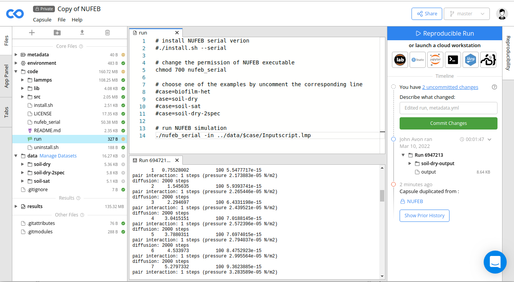

Run NUFEB
================================

This section describes how to run NUFEB 

.. contents:: 
		:local:
		:depth: 1
   

.. _run_nufeb:

Run NUFEB from terminal
--------------------------------

NUFEB run from the command line, reading commands from a file via the `-in` command line flag, or from standard input. 
NUFEB executable is located in the ``NUFEB-2`` directory. 
The name of the executable is ``nufeb_mpi`` or ``nufeb_gpu`` or ``nufeb_serial`` depending on the selected option when compiling the code.

You normally run the nufeb command in the directory where your input script is located. 
That is also where output files are produced by default, unless you provide specific other paths in your input script or on the command line.

NUFEB provides numbers of examples available in the ``NUFEB-2/examples`` directory.
For example: 

 .. parsed-literal::
   cd NUFEB-2/examples/biofilm-het
   mpirun -np 4 nufeb_mpi -in nufeb.in

The above commands will run the input script ``nufeb.in`` in the ``NUFEB-dev/biofilm-het`` directory using NUFEB MPI executable with 4 CPU processors.
`mpirun -np X` command-line switch to specify the numbers of processors to run the simulation.

 .. parsed-literal::
  cd NUFEB-2/examples/biofilm-het/
  nufeb_serial -in nufeb.in

The above commands will run the ``NUFEB-dev/biofilm-het`` example using NUFEB serial executable with single processor.

 .. parsed-literal::
  cd NUFEB-2/examples/biofilm-het/  
  mpirun -np 2 nufeb_gpu -k on g 2 -sf kk -pk kokkos newton off neigh half binsize 2e-6 -in nufeb.in

The above commands will run the ``NUFEB-dev/biofilm-het`` examaple using NUFEB GPU executable with 2 GPUs and 2 CPUs.
In particular, the `-k on` command-line switch enable Kokkos support; `g 2` specify the use of 2 GPUs to run the simulation.
`-sf kk` enables NUFEB to use Kokkos variant styles of any commands defined in the inputscript; 
`-pk kokkos newton off neigh half binsize 2e-6` re-define the setting in the inputscript.

You can find more information about `command line options* <https://docs.lammps.org/Run_options.html>`_ and
`screen and logfile output* <https://docs.lammps.org/Run_output.html>`_ 
in `LAMMPS user manual <https://docs.lammps.org/Manual.html>`_.

Run NUFEB on Code Ocean
--------------------------------

`Code Ocean <https://codeocean.com/>`_ is a computational research platform for the creation, 
sharing, publication, preservation and reuse of executable code and data. 
The code and data (inputscripts) uploaded to Code Ocean are stored as a compute Capsule.
Each Capsule also contains environmental settings (docker file), and a directory for saving simulation results.
You can follow the steps below to use NUFEB on Code Ocean:

1. Create a Code Ocean account at https://codeocean.com/
2. Currently NUFEB is in a private Capsule. To access the code, email your account (Email address) to bowen.li2@newcastle.ac.uk so that we can share the code to you.
3. You should be able to see a new Capsule named NUFEB in your profile. Enter the Capsule and create a copy of it by clicking the menu **Capsule -> Duplicate**.
4. The NUFEB capsule provides several examples in the ``/data`` directory. To run one of them, go to the ``run-example`` file and choose the example that you want to run by uncomment corresponding line. 
   Then right click on the file in the left *File* panel, and select **Set as File to Run**.
5. Click the **Reproducible Run** button in the upper-right corner. During the simulation, information such as total number of individuals and biomass over time are printed in the console panel, 
   and output files are saved in the ``/results`` directory.
6. The capsule provides a pre-compiled NUFEB executable ``nufeb_serial``. You can also recompile the code by making ``run-install.sh`` as the run file (**Set as File to Run**), 
   then press the **Reproducible Run** button.
7. To download output files, right click on the ``/results`` directory and select **Download**.

   

