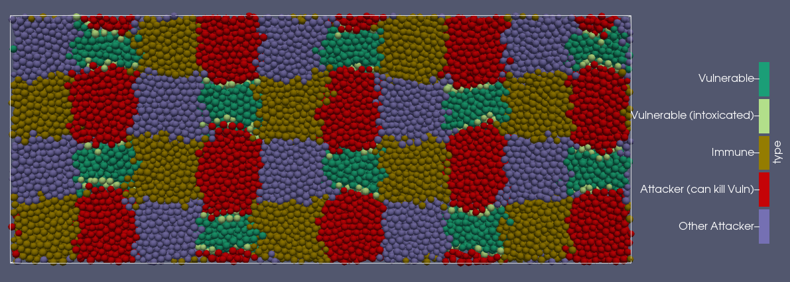

Adding Type VI Secretion System Interactions
============================================

By the end of the tutorial, you will have completed NUFEB inputscript which 
specifies a biofilm with an active Type VI Secretion System (T6SS). You will be able
to:

1. Specify which bacteria employ a T6SS and their associated toxin
2. Specify which bacteria are vulnerable to specific T6SS toxins
3. Specify the effects of intoxication on vulnerable bacteria

In this specific case, you will be setting two T6SS-capable attackers, each 
with a different toxin, a bacterium which is immune to all toxins, and a bacterium
which is immune to one toxin but vulnerable to the other.

Overview
--------

The Type VI Secretion System (T6SS) is a contact-based inhibition interaction between two bacteria and is expressed by about 25% of gram negative bacteria. 
One bacterium, the attacker, produces long 'nano-harpoons' similar to the tail of some phages. Those harpoons
carry a toxin effector protein which can inhibit or kill bacteria penetrated by the harpoons. The attackers generally constantly fire these harpoons
and avoid intoxicating their kin by also expressing immunity proteins. Likewise, some attacked non-kin may have their own immunities to specific effectors.

The T6SS module implements two ``fix`` commands which allow simulating this interaction in NUFEB.

1. ``nufeb/T6SS/contact`` specifies which bacteria are attackers, which are vulnerable, and details regarding toxins and contact distance. During a NUFEB run, this is the fix which actually detects contact and causes effected bacteria to be marked as intoxicated.
2. ``nufeb/T6SS/lysis`` governs how quickly a bacterium degrades once intoxicated.

Much as NUFEB must be installed/built with commands explicitly enabling ``vtk`` or ``hdf5`` output, the T6SS module must be explicilty enabled. This can be done with the ``--enable-t6ss`` argument when using the ``install.sh`` script or by running ``make yes-t6ss`` when building manually. 

.. seealso::
  
   :doc:`Installing NUFEB on Linux/Mac <install>`
   
   :doc:`Installing NUEFB on Windows  <install_win>`

   :doc:`T6SS Contact Fix  <fix_T6SS_contact>`

   :doc:`T6SS Lysis Fix  <fix_T6SS_lysis>`

Essential resources
-------------------

This tutorial assumes you have a working, installed NUFEB with the ``T6SS`` module enabled. We will refer to the default NUFEB executable name and location, if you've done something custom or if NUFEB is resolvable by your ``PATH``, feel free to substitute that.

All file paths will be relative to the installed NUFEB directory. For example, if NUFEB is located at ``/home/user1/software/nufeb/`` then ``./examples`` would refer to the absolute path of ``/home/user1/software/nufeb/examples``

You will be modifying the ``tutorial.nufeb`` inputscript to include the various lines which will implement the T6SS setup described in the introduction. That file is located in ``./examples/type_VI_secretion``.  You may want to make a copy of the file or example directory before performing any modifications if you are uncomfortable with restoring it from git. 

Modifying tutorial.nufeb
------------------------

``tutorial.nufeb`` is an incomplete inputscript which needs a few sections filled out to be both complete and to additionally specify the T6SS mechanisms.

The parts to be filled in are marked with lines such as: ``## TUTORIAL: Add Group Assignments here ##``. In this tutorial we will populate each section in turn. At the end, the filled in inputscript should match ``inputscript.nufeb`` already present in the directory.

As a reminder the simulation will have:

1. two T6SS-capable attackers, each with a different toxin
2. a bacterium which is immune to all toxins
3. a bacterium which is immune to one toxin but vulnerable to the other

.. note::
   We do not need to modify the ``atom.in`` file, as this already exists in working form for the example   ``inputscript.nufeb``.  However, note that the number of atom types specified is ``5``.  This is the total number of *potential* atom types. It is a common error to make number reflect the number of atom types with initial locations. Here, that would be four (the two attackers, the immune, and the vulnerable). The fifth atom type is the one representing intoxicated vulnerable organisms, which are not initially present.

Specifying microbial types and groups
^^^^^^^^^^^^^^^^^^^^^^^^^^^^^^^^^^^^^

In any NUFEB simulation bacterial taxa and states are organised by groups and types. It is those groups and types which are used to identify which simulation commands/fixes apply to which organisms, thus governing how they behave.

In line 30 of ``tutorial.nufeb`` please replace the comment: ``## TUTORIAL: Add Group Assignments here ##`` with the following:

.. code::

    group           attacker type 1
    group           immune type 2
    group           vuln type 3
    group           vuln_intoxicated type 4
    group           attacker_other type 5
    group           dead empty
    group           HET type 1 2 3 5

In the first 5 lines, we are using the LAMMPS ``group`` command to name the various groups of bacteria used in the scenario and associate them with a type code.  For example, the main attacker is given the name ``attacker`` and associated with type ``1``.

Note that there is not a 1:1 mapping between groups and taxon identity. It is generally preferable to let groups represent functionality. For example, the vulnerable bacteria has two states (normal and intoxicated), and we use two groups to represent that.

The ``dead`` line is a special case - there is no numerical type code.  In many NUFEB simulations, the ``dead`` group is used to hold organisms which have stopped growing, may be decaying, and when small enough removed entirely from the simulation.

In the final line you might notice that a group can be associated with multiple types and that a type can be associated with multiple groups.  We can use this to flexibly apply behviours to different collections of bacteria.  Here, we are defining a group which includes all those types which should grow as normal heterotrophs with identical parameters.

The result of this 'meta-group' is that the already existing lines governing heterotrophic growth and applied to ``HET`` do not need to be modified or duplicated. If you wanted the attacker to grow more slowly than the others (which may be biologically more realistic), you could remove ``1`` from the final line and specify growth fixes which only apply to the ``attacker`` group.

Using groups and types this way is a powerful way to control your simulations, and gaining experience with them is highly suggested.

.. seealso::

   `LAMMPS group command <https://docs.lammps.org/group.html>`_

Defining lysis behaviour for intoxicated individuals 
^^^^^^^^^^^^^^^^^^^^^^^^^^^^^^^^^^^^^^^^^^^^^^^^^^^^

Organisms intoxicated by the Type VI System don't simply disappear, but rather tend to be inhibited and decay.
Because ``vuln_intoxicated`` has a type of ``4``, that type is not part of the ``HET`` group, and the only grow fix applies to only the ``HET`` group, any intoxicated individual will automatically cease to grow.  If you would rather have the intoxicated individual simply grow more slowly, you could define a growth fix, applicable to the ``vuln_intoxicated`` group, with a reduced growth rate parameter.

Either way, if you want intoxicated organisms to undergo lysis and eventual death, you need to specify that. To do so, please replace the line ``## TUTORIAL: Define Lysis Step Here`` with the following:

.. code::

    # lysis of intoxicated cells
    fix lysis_vuln vuln_intoxicated nufeb/T6SS/lysis sub 2e-3 0.2

Lysis within NUFEB is implement as mass loss with a potential conversion of the mass lost to substrate.  Here, you've specified that every time step all organisms within the ``vuln_intoxicated`` group should diminish in mass with a rate of 2e-3 inverse seconds.  This value is in agreement with previously observed T6SS lysis rates.  In addition, 20% of the lost mass should be considered readily biodegradable and enter the local area of the simulation as substrate.

.. seealso::

    :doc:`T6SS lysis fix <fix_T6SS_lysis>`

Defining the actual T6SS interactions
^^^^^^^^^^^^^^^^^^^^^^^^^^^^^^^^^^^^^

A T6SS interaction has two components, bacteria which are able to attack and those which may be vulnerable to attack. Within each of those components, there are additional parameters, such as the length of the nanon-harpoon, or which effectors are actually toxic to a vulnerable bacteria.  All of these are specified within the ``nufeb/T6SS/contact`` fix. During runtime, the fix uses these parameters to determine when attacks happen and, if appropriate, move any vulnerable individuals into the appropriate intoxicated group. Immunity to a toxin in implicitly specified - if an organism is not listed as vulnerable to a specific toxin, then there is no effect.

Because there can be varying numbers of relevant groups and because of the number of parameters, we recommend using the LAMMPS line continuation operator ``&`` to format the command.  To specify the T6SS parameters, please replace the line ``# define and carry out T6SS interactions`` with the following:

.. code::

    fix apply_t6ss all nufeb/T6SS/contact 1701 &
        2 1 1 1.3e-6 100 &
          5 5 1.3e-6 100 &
        1 3 1 1 vuln_intoxicated 4

There are 3 logical blocks in the above:

1. Specifying the fix itself (first line)
2. Defining attacker properties (lines 2 and 3)
3. Defining vulnerable properties.

A detailed breakdown is in the nufeb/T6SS/contact documentation, but briefly:

1. The ``1701`` parameter is the seed used by the random number generator for the T6SS.
2. The first line of the attacker block has a ``2`` as the first parameter. This allows the fix to know how many attackers will be specified and read the correct number of parameters. As formatted here this can also be understood as 'how many lines specify attackers'.
3. The subsequent parameters on the attacker line specify: the type ID of the attacker, an ID to associate with their effector toxin, the length of the harpoon, and the (unused) time between attacks.
4. The first number of the vulnerable block has a ``1``, signifying only one vulnerable organism will be specified.
5. The subsequent parameters of that line indicate the: type ID of the vulnerable organism, an effector ID to which it is vulnerable, the (unused) probability of intoxication, and the group name and type ID to use when moving it into an intoxicated state.

By looking these properties, we can see that organisms with type codes ``1`` and ``5`` (which are in the ``attacker`` and ``attacker_other`` groups) have T6SS systems and that they have different effectors, identified with ``1`` and ``5``. There is no requirement that the effector ID matches the type code, but we suggest following this convention when possible.

We can also see that there is one organism with the type code ``3`` (corresponding to the ``vulnerable``) group which is susceptible to T6SS attacks when the effector is ``1``. If intoxicated, the organism should be moved into the ``vuln_intoxicated`` group and given a type of ``4``. The vulnerable organism is however implicitly immune to the T6SS system expressing effector ``5``.

.. seealso::

    :doc:`T6SS contact fix <fix_T6SS_contact>`

Running and visualization
^^^^^^^^^^^^^^^^^^^^^^^^^

The filled-in tutorial script can be run via:

``../../nufeb-mpi -in tutorial.nufeb`` and, assuming NUFEB was built with vtk output enabled, can be visualized with Paraview.

You should see a grid of colonies growing over time, with colonies of bacteria type 1 killing off and invading colonies of bacteria type 4.

The results should be qualitatively similar to those seen when running:

``../../nufeb-mpi -in inpuscript.nufeb``

As an example, the image below shows the simulation after 44 time steps. Organisms are colour-coded by the type and the view is looking up at the bottom of the growing biofilm.

